# COASTAL GARDENS


[View Live Website here.](https://coastal-gardens-e950c82335fb.herokuapp.com/)

[GitHub Repo](https://github.com/LemmenAid/coastal-gardens)

***

## Index – Table of Contents
* [Features](#features)
* [Project Development](#project-development)
* [Layout](#layout)
* [Design](#design)
* [Technologies Used](#technologies-used)
* [Testing](#testing)
* [Solved Bugs](#solved-bugs)
* [Deployment](#deployment)
* [Credits](#credits)

***

### Project Description  

_Coastal Gardens is a website for my fourth portfolio project with [Code Institute](https://codeinstitute.net/ie/)._

Coastal Gardens is a website designed to connect and support coastal gardeners in Ireland and the UK. Focused on the unique challenges and rewards of gardening by the sea, the site provides a selection of feature posts, plant zone information, and, by becoming members, unlock a personalized dashboard. Members have the opportunity to save favorite posts, keep track of their comments, and publish their own garden stories to inspire other coastal gardeners.

### Project Purpose

The purpose of Coastal Gardens is to create an online community dedicated to coastal gardening. Recognizing the specific needs of gardening by the sea, the platform aims to be a comprehensive resource for both beginners and seasoned gardeners facing the unique conditions of the coast. By providing a space for knowledge exchange, storytelling, and advice, Coastal Gardens empowers gardeners to create thriving and resilient gardens.

***

## Features

### General Features on each page

#### Navigation Bar

* Featured on all pages, the full responsive navigation bar includes links to the Home page, About, Features, Sign Up, Login, and Contact Us page and is identical on each page to allow for easy navigation.

* If a member is logged in the Dashboard page and Member Stories page will also be visible in the navigation bar. 

Navigation bar:<br>
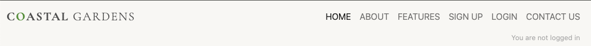

Navigation bar for members:<br>
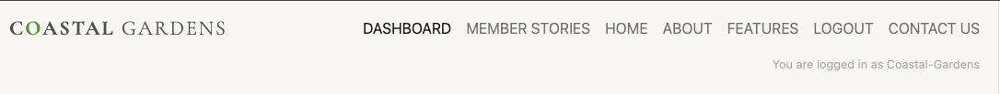

Dropdown navigation menu:<br>
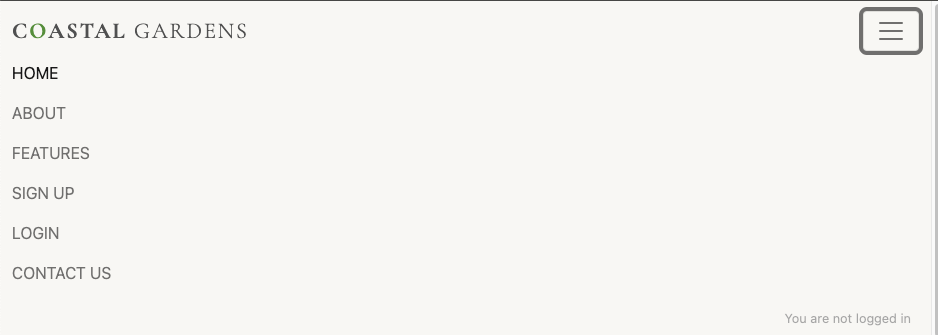

***

#### The Footer

Featured on all pages, the footer section includes a logo that links to the home page, a sign up button,copyright information and a link to the GitHub Repository.


***

#### Square Links

The Square Links are displayed on all pages. The links make it easy for users to navigate between pages while also adding visual appeal that encourages exploration across the site.

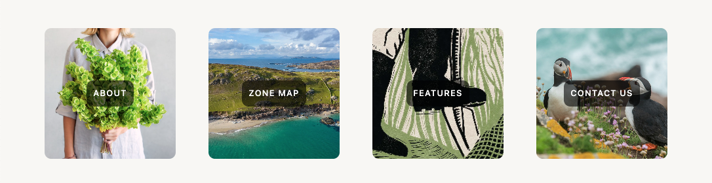

***

### Features by page

#### Home Page
The Home Page serves as an inviting introduction to Coastal Gardens with a captivating hero image and a clear call-to-action button leading to the sign-up page. The "What's New?" section highlights the three latest posts, keeping content fresh and engaging for returning visitors. Below, visually appealing square links guide users to key pages, offering easy navigation across the site.

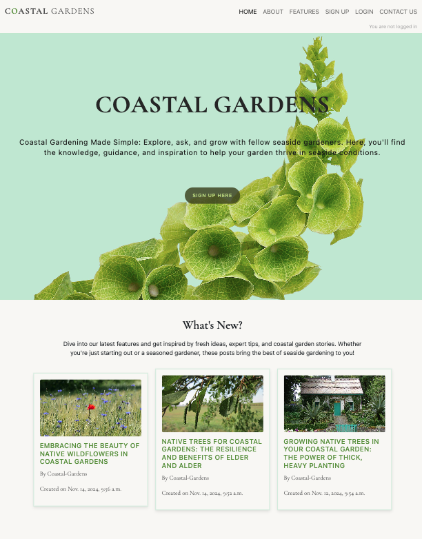

***

#### About Us Page
The About Us page introduces Coastal Gardens’ mission, explaining the importance of community and knowledge-sharing for coastal gardening enthusiasts in the UK and Ireland. It helps new users understand the site's goals and encourages them to join.

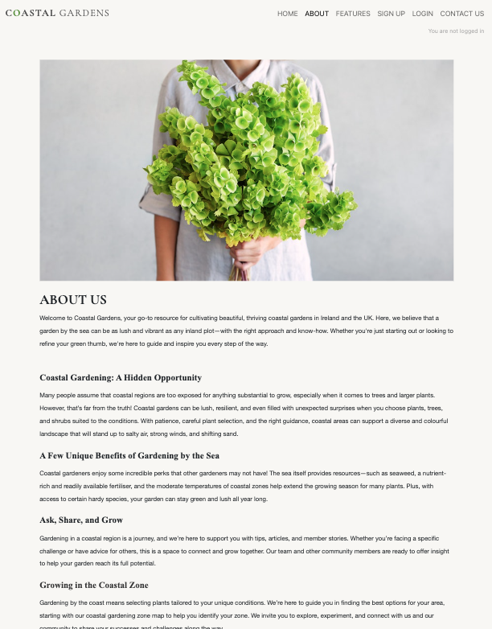

***

#### Features Page
The Features page showcases Coastal Gardens' most recent articles and resources, displayed from newest to oldest. This page offers a broad view of content, covering expert tips, gardening insights, and coastal plant recommendations.

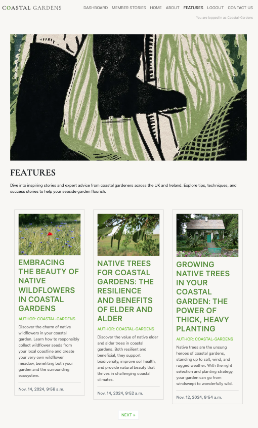

***

#### Dashboard
The personalized Dashboard page provides logged-in members with an overview of their saved features, their own written stories, and all comments they’ve made. A “Create Story” button is available, allowing members to publish their own coastal gardening experiences directly to the Member Stories page.

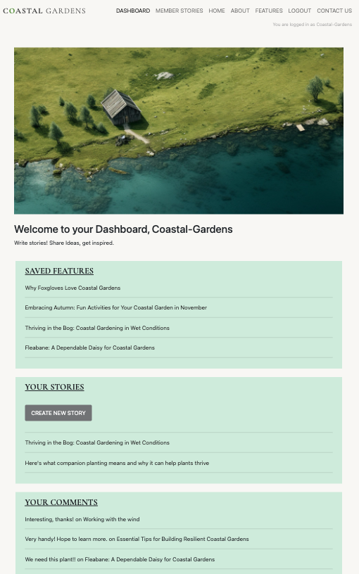

***

#### Create Story Page
This page allows members to create and publish their own stories by inputting a title, uploading an image, and writing a blog post and excerpt. The user-friendly layout encourages members to share their knowledge and unique gardening experiences.

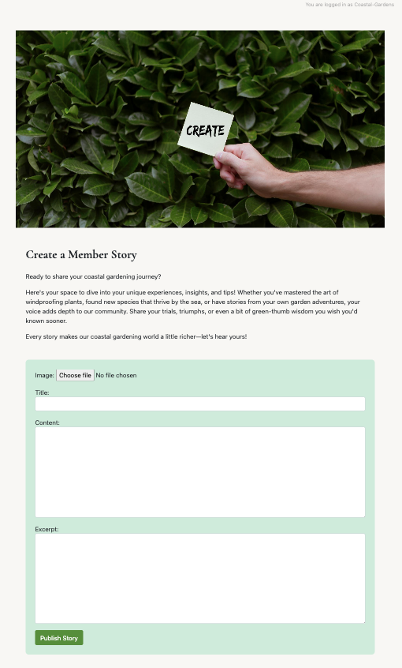

***

#### Member Stories Page
The Member Stories page is a member-exclusive section where users can read stories and insights shared by other community members. This feature encourages a sense of community and gives members access to firsthand experiences in coastal gardening.

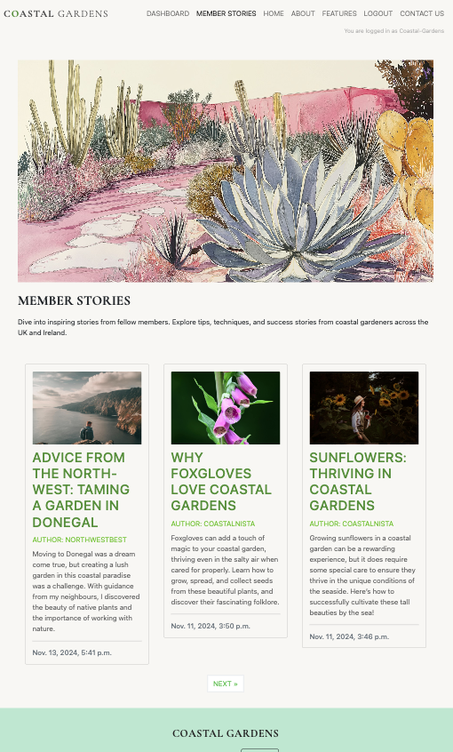

***

#### Story / Feature Page
When members are logged in, they have the option to save Member Stories and Feature Stories, which are stored on their personal dashboard. Each story includes a Save button; once a story is saved, the button updates to an Unsave button for easy management.
<br>
<br>
Members can also delete their own stories, with the Delete button visible only to the author of the story. Additionally, logged-in members can leave comments on stories and have the ability to edit or delete their own comments.
<br>
<br>
For users who are not logged in, the Save, Delete, and Comment options are not available.
<br>
<hr>

#### Story and comments when logged in:
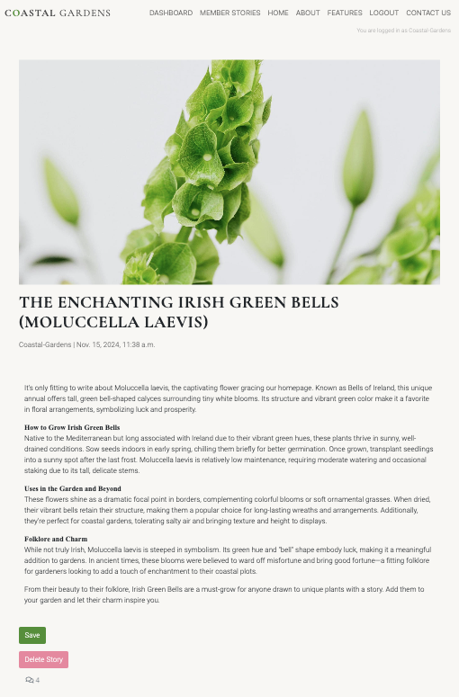
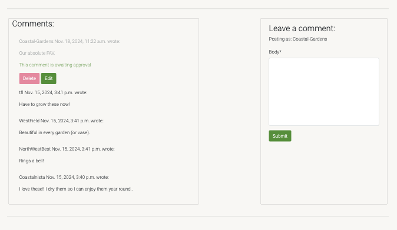

#### Story when logged in, but not the Author:
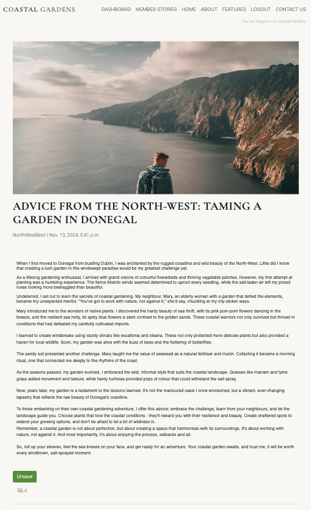
<br>

#### Story and comments when logged out:
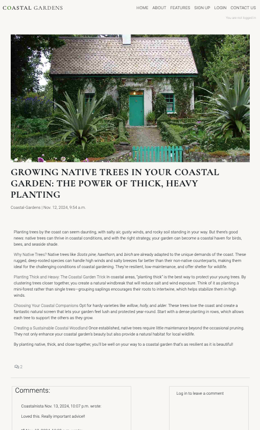
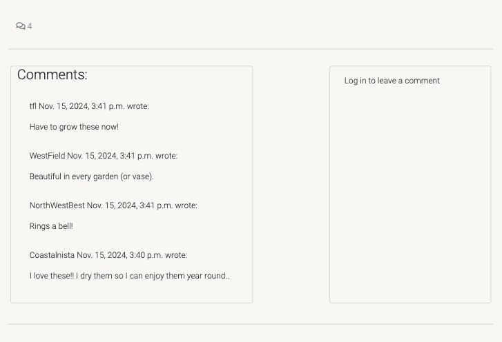

***

#### Sign Up Page
The Sign-Up page includes standard registration fields with added questions about gardening experience level and the user’s garden zone. This customization helps Coastal Gardens offer a more tailored experience for each member.

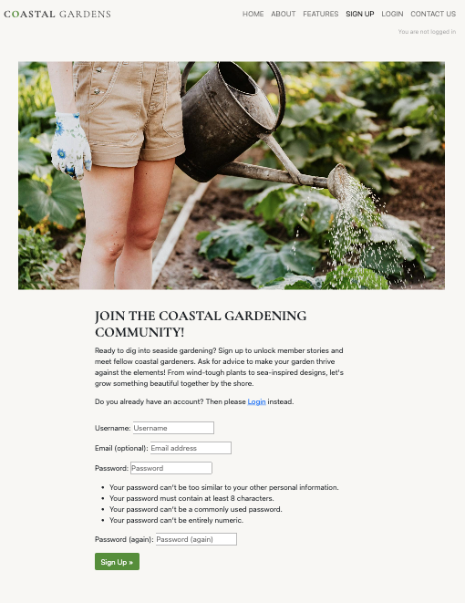

***

#### Contact Us Page
The Contact Us page provides a direct way for users to reach out with inquiries or feedback. It ensures members feel supported and have access to help if needed.

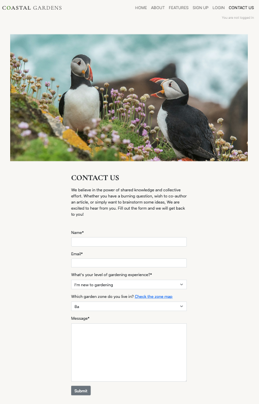

***

### Future Implementations

* One future feature planned for Coastal Gardens is a Reddit-style Q&A advice page. This page would allow members to post gardening questions and receive answers from the community, promoting knowledge-sharing among users with various experience levels. Members could upvote helpful responses, making it easy to identify valuable advice and reliable contributors. This addition would create an interactive support space, further enhancing the community feel of Coastal Gardens.

* Another future enhancement could be a “Garden Planner” feature. This planner could provide personalized monthly to-do lists where gardeners can focus on timely tasks like planting, pruning, and seasonal maintenance.

* A direct messages option between members.

* A gallery page of all images features on the website.

***

## Project Development

### Creating Process

When I started developing Coastal Gardens, it was my first time working on a project that combined both backend and frontend development using the Django web Framework, and my second time using Python. This project presented a steep learning curve, especially as I tackled the challenges of Django, CSS, and user interactivity. I wanted to create something with real-world application, so the idea of a resource for coastal gardeners felt both meaningful and practical.

At the beginning, I felt unsure about how to approach the project, but as I started coding, things began to click. Working through each part of the website—from creating basic pages to designing the user experience—helped me better understand the concepts from my lessons. The process not only taught me more about Python logic and web frameworks, but also boosted my confidence as I realized I could solve problems and make the website functional.

The creative process became really enjoyable as I saw the website take shape, and I'm happy with how far I have gotten with it - it’s a website gardeners in Ireland and the UK could use to share stories, access local gardening advice, and find inspiration for their coastal gardens.

### Project SetUp

For setting up Coastal Gardens, I followed the CodeStar follow-along project structure, customizing it to create a unique platform for coastal gardening enthusiasts.

I began by building a Django framework, developing the foundational pages (Home, About, Features, and Zone Map) that offer general information to anyone interested in coastal gardening. Once this structure was stable, I added unique member features, including a personalized dashboards and the option for members to write and share blog posts exclusively within the community.

This was my first experience handling both backend and frontend tasks together, which was challenging but rewarding. Developing these elements involved custom logic for saving, displaying, and managing user-generated content in a way that’s engaging and intuitive. Testing each step along the way helped me ensure smooth functionality and an accessible user experience.

Overall, this process taught me a lot about web development and reinforced concepts from my coursework in a real-world setting, helping me build confidence in my coding abilities.

Jump to Credits: [Credits](#credits)

***

### Agile Development

[GitHub Projects](https://github.com/users/LemmenAid/projects/5/views/1) served as an Agile tool for the development of this project. 

I started with creating the User Stories. Then these stories were broken down into tasks as steps to follow in the building process of the website. I added these steps to the Project Board on Github to keep track of the buidling process and to assist with better organisation and prioritisation of the tasks. 


<details>
<summary> User Story Template
</summary>

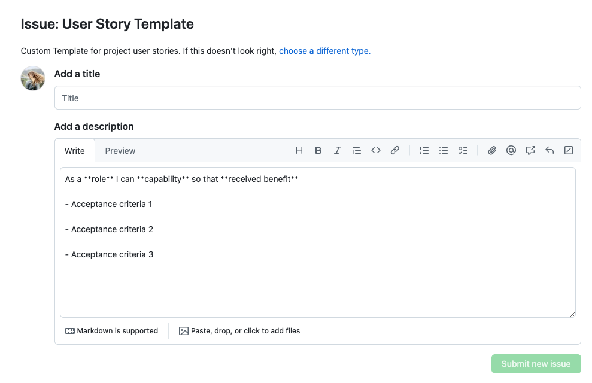
</details>

<details>
<summary> User Story Issues
</summary>


</details>

<details>
<summary> Project Board
</summary>

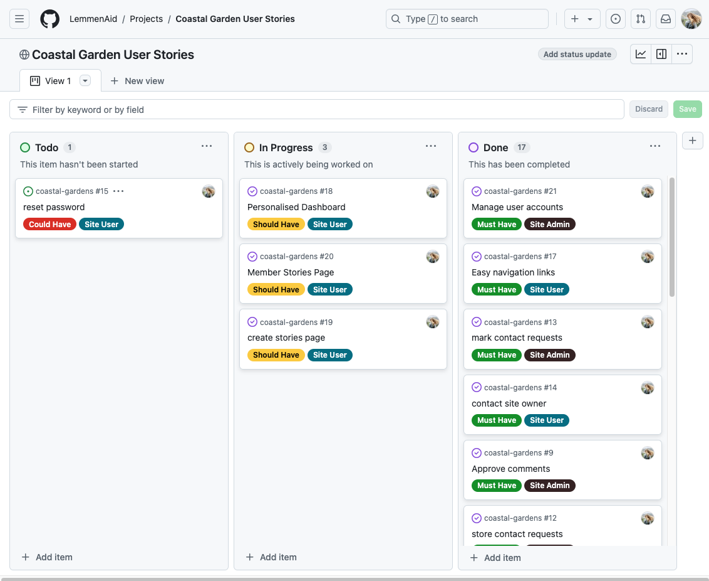
</details>
<br>

***

### User Stories

VISITOR

1. As a Visitor, I want to browse feature articles on coastal gardening, so that I can learn more about gardening by the sea.
2. As a Visitor, I want to understand the plant zone map, so I can determine in which zone I live.
3. As a Visitor, I want to read an About page to understand the purpose and mission of the site.
4. As a Visitor, I want to easily navigate to different sections of the site, so I can find relevant information quickly.

POTENTIAL MEMBER

5. As a Potential Member, I want to view a sign-up page that explains the benefits of joining, so I know why I should become a member.
6. As a Potential Member, I want a simple registration process, so I can quickly join the community.

MEMBER

7. As a Member, I want a personalised dashboard where I can save and view my favourite articles, so I can easily revisit them.
8. As a Member, I want to see a list of all my comments in one place, so I can keep track of my participation.
9. As a Member, I want the ability to write and publish my own gardening stories, so I can share my experiences with other members.
10. As a Member, I want access to member-only stories, so I can learn from the experiences of other coastal gardeners.

ADMIN

11. As an Admin, I want to manage feature posts and member stories, so that the content is relevant, accurate, and engaging for users.
12. As an Admin, I want to moderate comments, so I can ensure a respectful and constructive environment.
13. As an Admin, I want to manage user accounts, so I can assist with membership issues and maintain site quality.

***

## Layout

### Wireframes

The layout is clean and minimal, with a balance of serif and sans-serif fonts for a modern, magazine-like feel. Navigation is streamlined through a clear menu bar, with links to key areas such as Features, Dashboard, and About.

Key interface elements include:

- Interactive buttons for saving and deleting stories, visible only when applicable.
- Easy-to-use forms for commenting and posting blogs.
- Clear error pages that redirect users when something goes wrong.
- Responsiveness is a priority, ensuring smooth usability on mobile and desktop devices.

The basic layout for the website was designed using wireframes with Balsamiq.

<details>
<summary> Home Page
</summary>

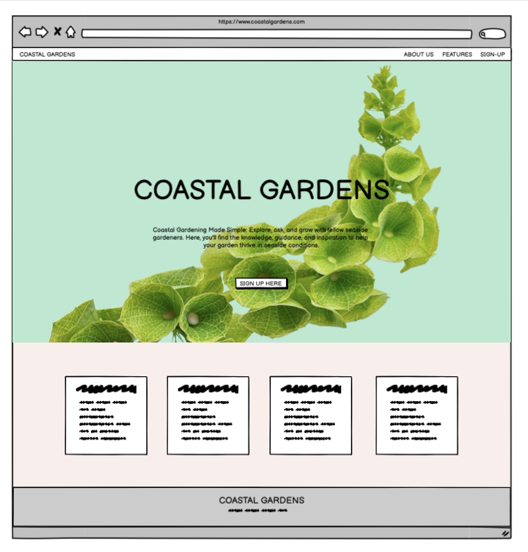<br>

</details>

<details>
<summary> Text Pages
</summary>

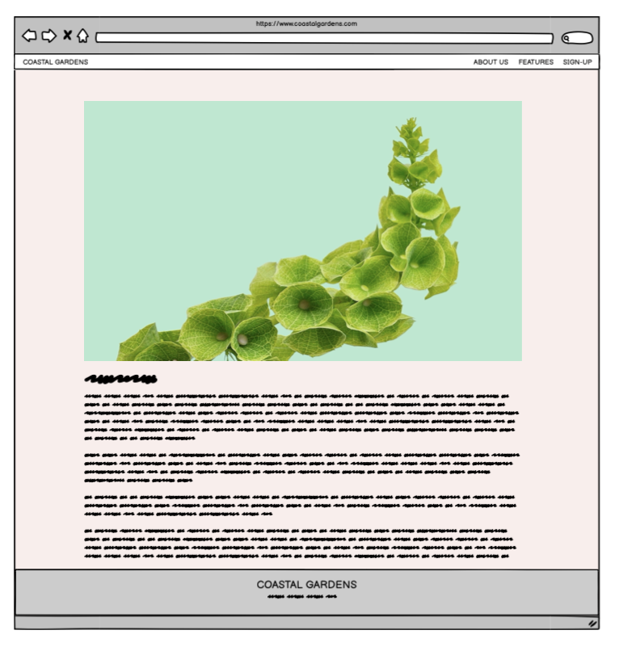<br>

</details>

<details>
<summary> Features Page
</summary>

<br>

</details>

<details>
<summary> Mobile View
</summary>

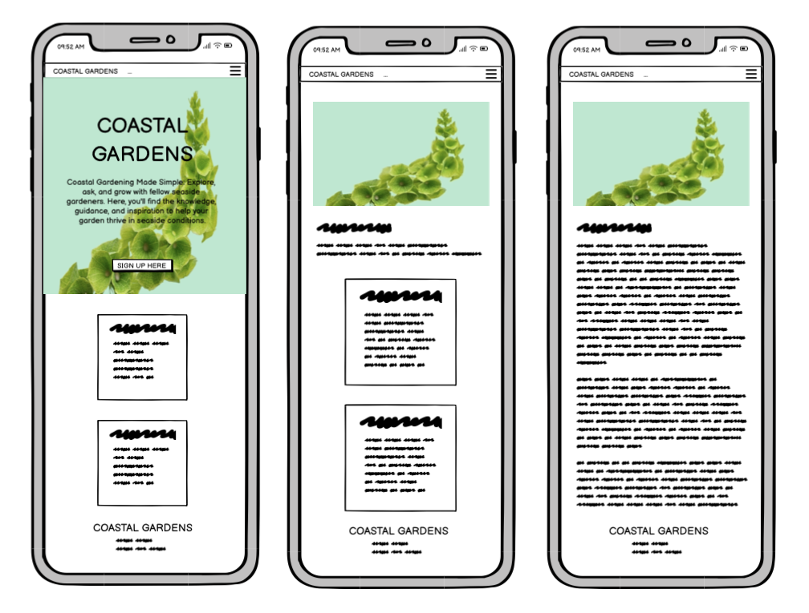<br>

</details>
<br>

***

### Database Models / ERD's

While planning this project, I drew up an Entity Relationship Diagram to help me to visualise the database models and their relationships.

<details>
<summary> Entity Relationship Diagram (ERD)
</summary>

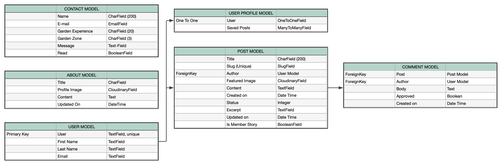

</details>

***

## Design

### Colour Scheme

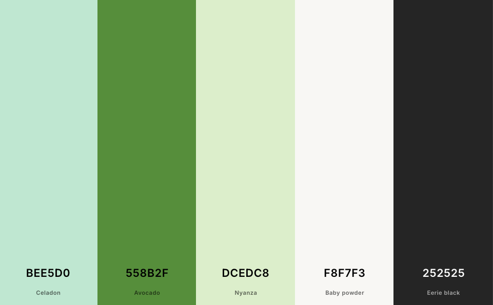

The Coastal Gardens colour scheme draws inspiration from the coastal landscape, incorporating natural tones that aligns with the garden-focused theme.

Wanting to keep the design clean and clear, I have used only a few hues of green for adding colour. Making sure the attention of the reader is mostly drawn to the content. <br>
I have chosen a light neutral for the background, which feels more natural than pure white and a deep charcoal for headers and accents to provide the necessary contrast, ensuring readability and accessible text elements without overwhelming the page.

### Typography

The typography on Coastal Gardens combines Cormorant Garamond with Roboto, a clean sans-serif font, to create a modern magazine-like feel. Cormorant Garamond adds an elegant, editorial touch, while the Roboto font keeps the content easy to read. 

The following code has been imported into the top of the base.html file:

    <link href="https://fonts.googleapis.com/css2?family=Cormorant+Garamond:wght@400;500;600;700&display=swap" rel="stylesheet">

    <link href="https://fonts.googleapis.com/css2?family=Roboto:wght@300&display=swap" rel="stylesheet">

Roboto:<br>
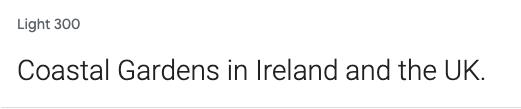<br>
Cormorant Garamond:<br>
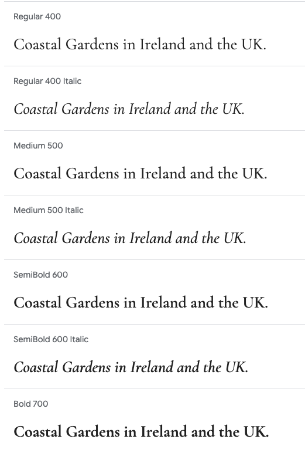<br>

### Imagery

Several image sources were used for the images throughout the website.<br>

<details>
<summary> The links to these sources are listed here:
</summary>

* [Hero Image, Bells of Ireland](https://floralife.com/article/bells-of-ireland-troubleshooting/)
* Photo by Image Hunter: https://www.pexels.com/photo/hand-holding-note-on-green-bush-background-13092789/
* Photo by Dave Love: https://www.pexels.com/photo/extreme-close-up-of-a-ripe-dandelion-17401938/
* Photo by Photo By: Kaboompics.com: https://www.pexels.com/photo/plants-on-white-background-4736271/
* Photo by Lukas Medvedevas: https://www.pexels.com/photo/a-man-standing-on-the-mountain-6013664/
* Photo by Vicky Sim: https://unsplash.com/photos/brown-and-white-1-storey-house-surrounded-by-trees-VYRc_uIafIg?utm_content=creditCopyText&utm_medium=referral&utm_source=unsplash/
* Photo by Dmitrij Paskevic: https://unsplash.com/photos/white-concrete-house-beside-road-SGuK8EIUx_Y?utm_content=creditCopyText&utm_medium=referral&utm_source=unsplash/
* Photo by Johny Goerend: https://unsplash.com/photos/aerial-view-of-green-grass-field-near-body-of-water-during-daytime-cGMTvIzhmAA?utm_content=creditCopyText&utm_medium=referral&utm_source=unsplash/
* https://www.lummi.ai/photo/a-close-up-view-of-a-lake-and-grass-near-a-cabin-in-t-e8db6be2-994a-4f68-b3f3-54493d2929d8-GuY3A
* https://www.lummi.ai/photo/underwater-serenity-hx6rp
* Photo by Steve W: https://www.pexels.com/photo/close-up-photo-of-labrador-on-flower-field-4200202/
* Photo by Wynand van Poortvliet: https://unsplash.com/photos/two-black-and-white-birds-4AmyOdXZAQc?utm_content=creditCopyText&utm_medium=referral&utm_source=unsplash/
* Photo by Kristina Paukshtite: https://www.pexels.com/photo/blue-white-and-red-poppy-flower-field-712876/
* Photo by Joerg Hartmann from Pexels: https://www.pexels.com/photo/poppy-on-meadow-17832251/
* Photo by Photo By: Kaboompics.com: https://www.pexels.com/photo/person-in-brown-shorts-watering-the-plants-4750270/
* Photo by Roy Manuhutu: https://www.pexels.com/photo/close-up-photo-of-flower-with-spiderweb-4099836/
* Photo by Helena Jankovičová Kováčová from Pexels: https://www.pexels.com/photo/red-poppies-on-meadow-25578696/
* Photo by Helena Jankovičová Kováčová: https://www.pexels.com/photo/close-up-of-red-berries-on-a-branch-outdoors-29238660/
* https://www.gardensillustrated.com/features/wildlife-sand-habitats-gardens
* Photo by Brendan Rühli: https://www.pexels.com/photo/close-up-of-blue-flowers-7268049/
* Photo by Amie Roussel: https://www.pexels.com/photo/gardener-in-autumn-sunflower-garden-28965902/
* Photo by Everson Marcos de Carvalho: https://www.pexels.com/photo/latin-american-fleabane-in-close-up-shot-12711555/
* Photo by Tommes Frites: https://www.pexels.com/photo/a-single-cornflower-in-a-field-with-wheat-27797805/
* Photo by Werner Redlich: https://www.pexels.com/photo/purple-foxglove-flowers-24287691/
* Photo by Drew Anderson: https://www.pexels.com/photo/branch-of-blooming-tree-with-blossoms-5549936/
* Photo by Daniil Komov: https://www.pexels.com/photo/black-and-gray-bird-flying-in-the-sky-10662583/
* https://www.lummi.ai/photo/a-close-up-view-of-a-lake-and-grass-near-a-cabin-in-t-e8db6be2-994a-4f68-b3f3-54493d2929d8-GuY3A/
* https://www.goodeggs.com/repettonursery/bells-of-ireland/5c82e8ba2a974d000e7099fe/
</details>

*** 

## Technologies Used

### Languages

* HTML
* CSS
* Javascript
* Python

### Frameworks, programs and libraries

* [Django](https://docs.djangoproject.com/en/5.0/) - Framework used to create website.
* [AllAuth](https://docs.allauth.org/en/latest/) - used to provide authentication framework for the project.
* [Django signals](https://docs.djangoproject.com/en/5.0/topics/signals/) - Using signals.py to automatically create a profile when a new member registers.
* [PostGreSQL database](https://www.postgresql.org/) - used as the relational database management for the website.
* [Github](https://github.com/) - Used for hosting the repository.
* [Gitpod](https://www.gitpod.io/#get-started) - Used for developing the application.
* [Am I Responsive?](https://ui.dev/amiresponsive) - Used to create an image of the website on various screen sizes.
* [Heroku](https://www.heroku.com/) - Used for deploying the live project.
* [Bootstrap 5](https://getbootstrap.com/) - Used to add style to the displayed pages
* [Pagination](https://getbootstrap.com/docs/4.0/components/pagination/) - Information page used to add more UX to the pagination list.
* [ChatGPT](https://chat.openai.com/) - Used to create the blogs, member stories and about page.
* [Code Beautify](https://codebeautify.org/) - Used to format HTML and CSS code.
* [Clouidnary](https://cloudinary.com/) - Used to host images and integrate with django and the admin portal.

### Design
* Fonts from [Google Fonts](https://fonts.google.com/) 
* Favicon [Favicon](https://favicon.io)
* Wireframes [Balsamiq wireframe](https://balsamiq.com/)
* Images from several sources, underwhich [Pexels](https://www.pexels.com/)
* Colour palette generator [Coolors](https://coolors.co/)

***

## Testing

### HTML validation

The [W3C HTML validator](https://validator.w3.org/) is used for validating the HTML code.<br>
All pages were checked and had no errors, apart from the cases I have described here:

The index.html page had a warning and info alert:
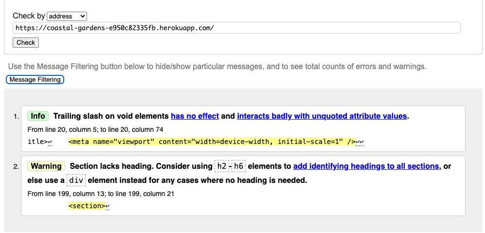

After fixing the info alert by removing the trailing slash and fixing the warning by replacing the section element by a div element the page came up with no errors or warnings.


The Sign Up page had a few errors, but I did not know how to fix them, because it was not in the code that I have written, but in the Django Allauth Form:
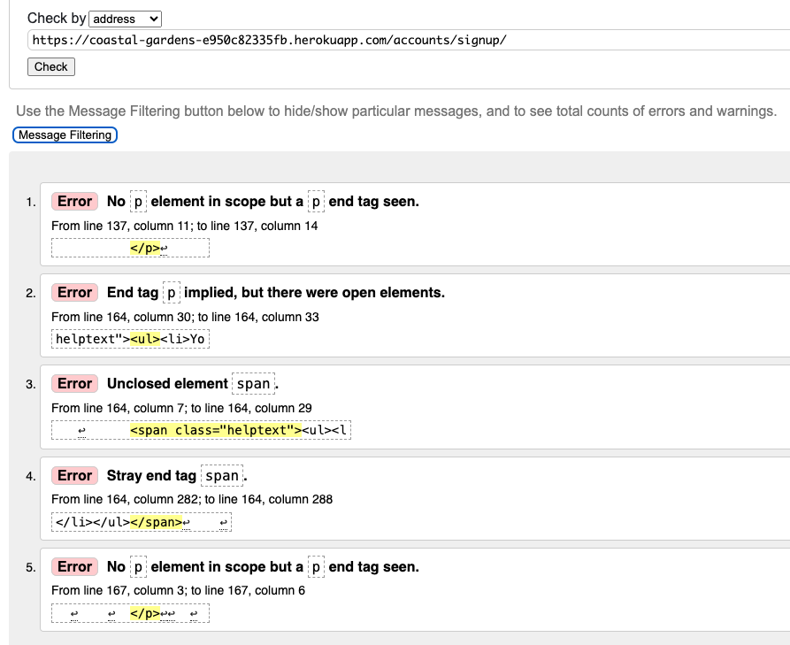

***

### CSS Validation

The [Jigsaw](https://jigsaw.w3.org/css-validator/) CSS Validator Services was used to validate the CSS code to make sure that no syntax errors were made in this project.

No Errors were returned:<br>
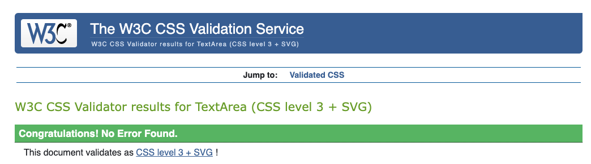

***

### JavaScript Validation
The [JS Hint](https://jshint.com) Validator was used to validate all the JavaScript code used troughout the project (the comments.js file, the contact-zone-map.js file and the javascript in the base.html file). After inserting /*jshint esversion: 6 */ at the top of the file no errors were returned apart from one undefined variable (bootstrap), but this is because the variable is defined in a different place.
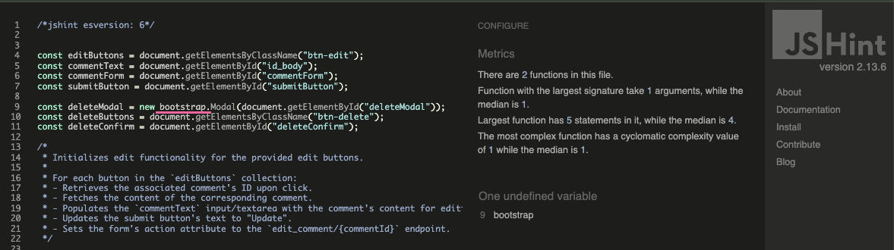

***

### Python Validation

The [CI Python Linter](https://pep8ci.herokuapp.com/#) is used for validation python code. All the .py files were checked and NO errors were reported:

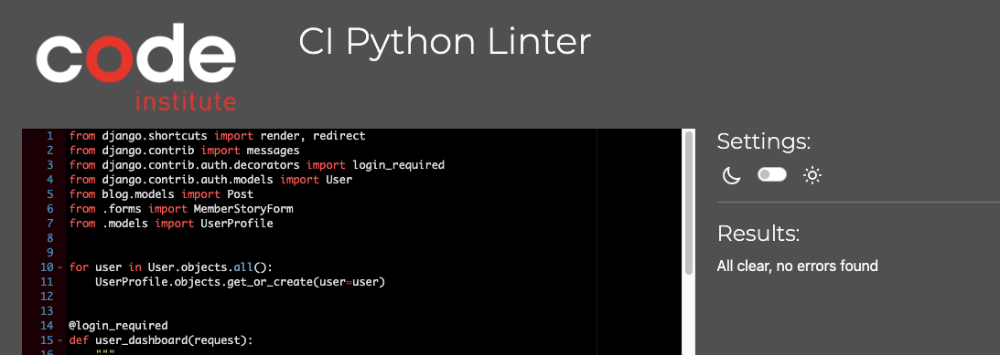

***

### Lighthouse

After validator testing I have used Chrome’s Lighthouse developer tool to check all pages for performance and accessibility. Overall I am happy with the outcome. However, the Best Practices is significantly influenced by Cloudinary images.

<details>
<summary> HOME PAGE
</summary>

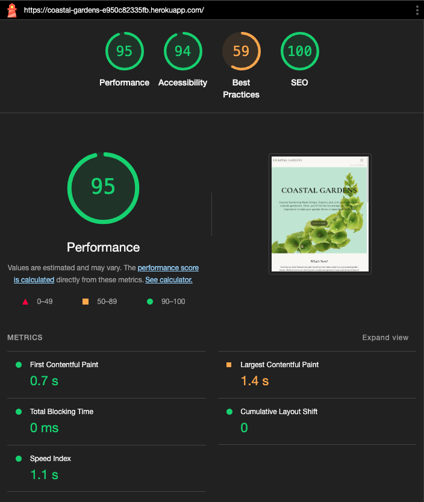

</details>

<details>
<summary> ABOUT US
</summary>

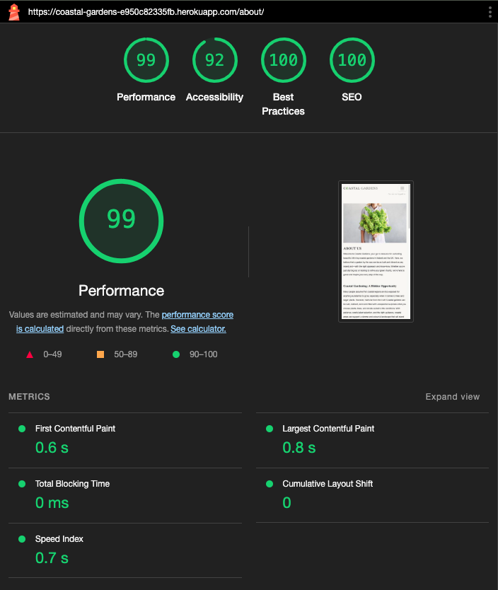

</details>

<details>
<summary> FEATURES
</summary>

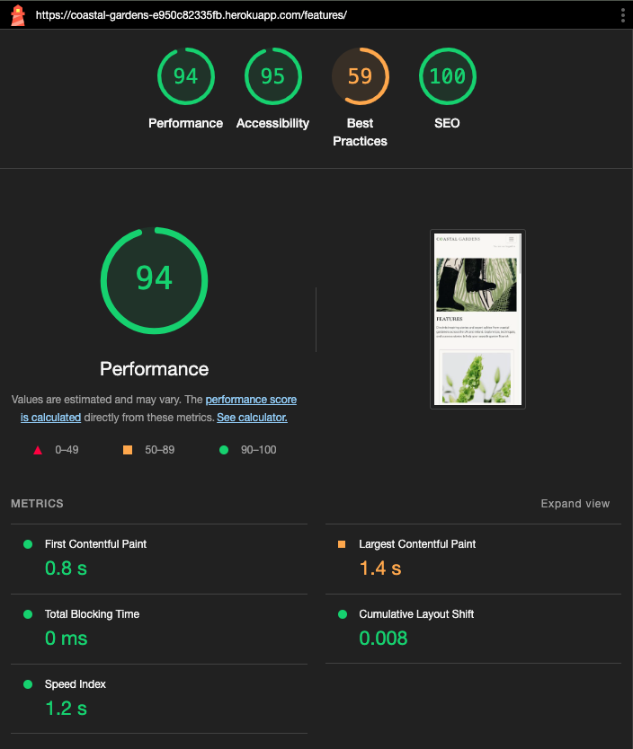

</details>

<details>
<summary> CONTACT US
</summary>

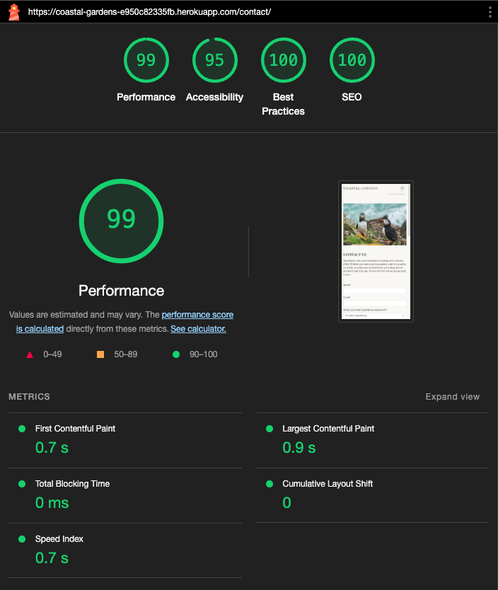

</details>

<details>
<summary> DASHBOARD PAGE
</summary>

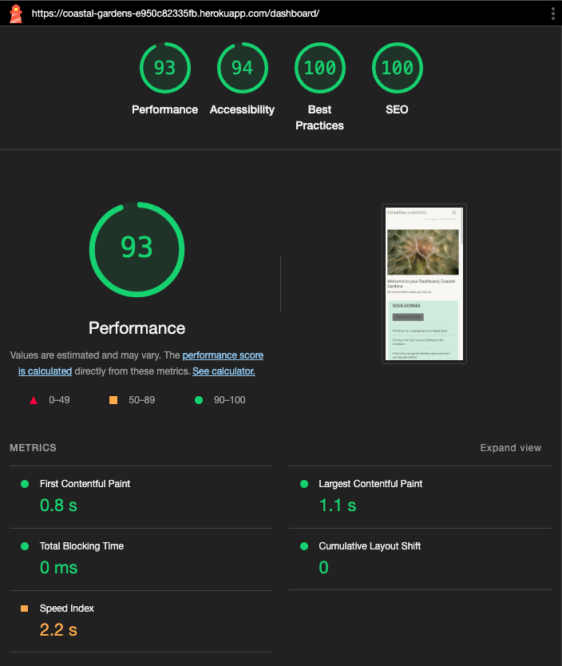

</details>

<details>
<summary> CREATE STORY
</summary>

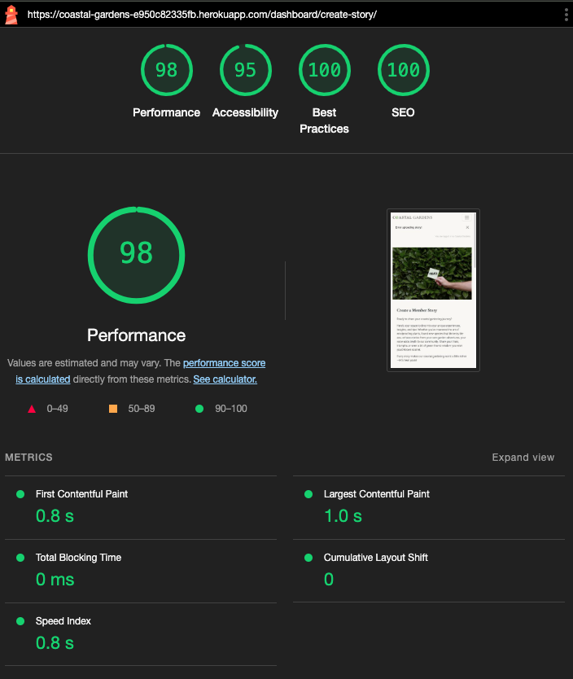
</details>

<details>
<summary> MEMBER STORIES
</summary>

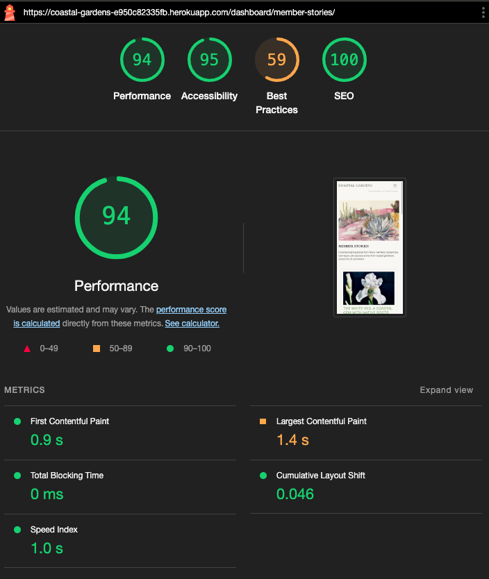

</details>

<details>
<summary> SIGN UP 
</summary>

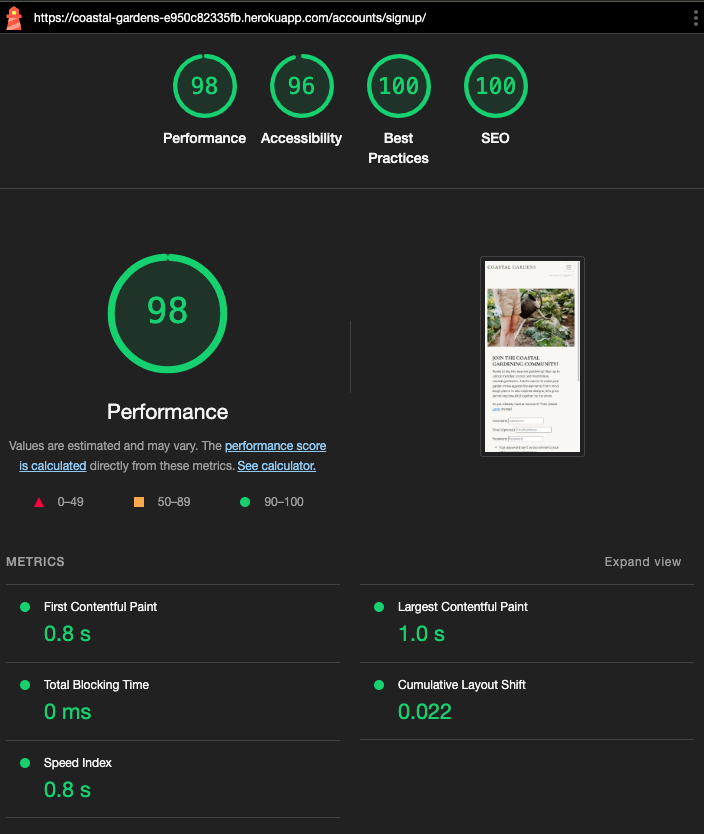

</details>

***

### Functionality Testing

### __Test Cases and Results__

<details closed>
<summary>The below table details the test cases that were used. </summary>
<br>

Want to add User Stories here.

| Feature | Testing Performed | Expected Outcome | Pass/Fail |
| --- | --- | --- | --- |
| Link Coastal Gardens header | click Title | When clicked the user will be redirected to the home page. | PASS |
| Internal Links | click on internal links | Internal links redirect to where they should. | PASS |
| External Links | click on external links | External links go where they should and open in separate tab. | PASS |
| Create Member Story | created/uploaded story on the create story page | As a logged in member I can write and upload a story with title, image, content and excerpt. | PASS |
| draft status member story | after uploading story, checked status to be 'draft' and not published | upon uploading a member story the Admin has to change the status of the story from draft to published before it will appear on the Member Stories Page | PASS |
| Hover buttons | checking the hover effect for buttons across the site |When hovered over a button the background colour changes to dark grey. | PASS |
| messages | checking feedback messages | After updating or deleting a comment as a user you get a feedback message. | PASS |
| messages disappear automatically | checking if messages disappear after 5 sec | After message appears it will automatically disappear. | PASS |
| Next button | checking next button on features page and member stories page | below features / stories there is a PREV and NEXT button | PASS |

</details>

*** 

### Responsivness
* The website has been tested on different devices(under which; iPhone SE / iPhone 12 / iPhone 14 / Samsung Galaxy S9 / MacBook Air / MacBook Pro / HP laptop).
* The website was responsive on all screens from mobile phones to desktops.
* Chrome DEV Tools have been used to check the responsivness throughout the development of the website.

***

### Browser Compatibility
Coastal Gardens was tested through the Heroku app website on the following browsers without issues:  
- Google Chrome (Version 132.0.6834.6)
- Mozilla Firefox (Version 132.0)
- Safari (Version 20619.2.8)
- Microsoft Edge (Version 131.0.2903.51)

***

## Solved Bugs

* During testing I replaced the Post.objects.get() line with get_object_or_404 in my save_post view. This ensures that if the Post with the given post_id does not exist, Django will return a 404 response instead of raising an exception.

* Added the 'status=1' filter in the user_dashboard view, to only include stories that are published in "Your Stories".

***

## Deployment 
_I have used several different READMEs to write the deployment section of this README.<br> 
All listed in the credit section below._<br>


The Live deplyed application can be found deployed on [Heroku](https://coastal-gardens-e950c82335fb.herokuapp.com/).<br>
This project was developed using [GitPod Enterprise](www.gitpod.io/) and committed to git and pushed to GitHub.

### Database
This project uses [Neon.tech](https://www.neon.tech) for the PostgreSQL Database. This was provided by Code Institute via a database-maker website for Code Institute Students.

### Cloudinary API

This project uses the Cloudinary API to store media assets online, due to the fact that Heroku doesn't persist this type of data.

To obtain your own Cloudinary API key, create an account and log in.<br>
On your Cloudinary Dashboard, you can copy your API Environment Variable.<br>
Be sure to remove the CLOUDINARY_URL= as part of the API value; this is the key.

### Heroku Deployment 

The application was deployed to Heroku. In order to deploy, the following steps were taken:

1. If you have an account, login to Heroku. Otherwise create a new account.
2. Once signed in, click the "New" button in the top right corner, below the header and choose "Create new app".
3. Choose a unique name for the application and select your region. When done, click "Create app".
4. This brings you to the "Deploy" tab. From here, click the "Settings" tab and scroll down to the "Config Vars" section and click on "Reveal Config Vars" and set your environment variables.

| Key | Value |
| --- | --- |
| `CLOUDINARY_URL` | user's own value |
| `DATABASE_URL` | user's own value |
| `DISABLE_COLLECTSTATIC` | 1 (*this is temporary, and can be removed for the final deployment*) |
| `SECRET_KEY` | user's own value |

Heroku needs two additional files in order to deploy:
- requirements.txt
- Procfile

You can install this project's **requirements** (where applicable) using:
- `pip3 install -r requirements.txt`

If you have your own packages that have been installed, then the requirements file needs updated using:
- `pip3 freeze --local > requirements.txt`

The **Procfile** can be created with the following command:
- `echo web: gunicorn app_name.wsgi > Procfile`
- *replace **app_name** with the name of your primary Django app name; the folder where settings.py is located*

For Heroku deployment, follow these steps to connect your own GitHub repository to the newly created app:

Either:
- Select **Automatic Deployment** from the Heroku app.

Or:
- In the Terminal/CLI, connect to Heroku using this command: `heroku login -i`
- Set the remote for Heroku: `heroku git:remote -a app_name` (replace *app_name* with your app name)
- After performing the standard Git `add`, `commit`, and `push` to GitHub, you can now type:
	- `git push heroku main`

The project should now be connected and deployed to Heroku!

<hr>

### Local Deployment
This project can be cloned or forked in order to make a local copy on your own system.
For either method, you will need to install any applicable packages found within the *requirements.txt* file.
- `pip3 install -r requirements.txt`.

You will need to create a new file called `env.py` at the root-level,
and include the same environment variables listed above from the Heroku deployment steps.

Sample `env.py` file:

```python
import os

os.environ.setdefault("CLOUDINARY_URL", "user's own value")
os.environ.setdefault("DATABASE_URL", "user's own value")
os.environ.setdefault("SECRET_KEY", "user's own value")

# local environment only (do not include these in production/deployment!)
os.environ.setdefault("DEBUG", "True")
```

Once the project is cloned or forked, in order to run it locally, you'll need to follow these steps:
- Start the Django app: `python3 manage.py runserver`
- Stop the app once it's loaded: `CTRL+C` or `⌘+C` (Mac)
- Make any necessary migrations: `python3 manage.py makemigrations`
- Migrate the data to the database: `python3 manage.py migrate`
- Create a superuser: `python3 manage.py createsuperuser`
- Load fixtures (if applicable): `python3 manage.py loaddata file-name.json` (repeat for each file)
- Everything should be ready now, so run the Django app again: `python3 manage.py runserver`

#### Forking repo on GitHub

By forking the GitHub Repository we make a copy of the original repository on our GitHub account to view and/or make changes without affecting the original repository by using the following steps...

1. Log in to GitHub and locate the [GitHub Repository](https://github.com/)
2. At the top of the Repository (not top of page) just above the "Settings" Button on the menu, locate the "Fork" Button.
3. You should now have a copy of the original repository in your GitHub account.

#### Making a Local Clone

1. Log in to GitHub and locate the [GitHub Repository](https://github.com/)
2. Under the repository name, click "Clone or download".
3. To clone the repository using HTTPS, under "Clone with HTTPS", copy the link.
4. Open Git Bash
5. Change the current working directory to the location where you want the cloned directory to be made.
6. Type `git clone`, and then paste the URL you copied in Step 3.

```
$ git clone https://github.com/YOUR-USERNAME/YOUR-REPOSITORY
```

7. Press Enter. Your local clone will be created.

```
$ git clone https://github.com/YOUR-USERNAME/YOUR-REPOSITORY
> Cloning into `CI-Clone`...
> remote: Counting objects: 10, done.
> remote: Compressing objects: 100% (8/8), done.
> remove: Total 10 (delta 1), reused 10 (delta 1)
> Unpacking objects: 100% (10/10), done.
```

***

## Credits

* I would like to thank Brian Macharia for his great mentor support and guidance - helping me through the process of building my first ever full stack website.
* My facilitator Lewis from Code Institute for supporting us through our fourth project and giving us great tips and resources for learning tools, and her feedback during the weekly stand-ups.
* At last I would like to give thanks to my friends and family for taking the time to test the website and giving me great feedback.

### Content

I have taken inspiration and information from the following websites for Coastal Gardens:

* [Garden Illustrated](https://www.gardensillustrated.com)
* [RHS](https://www.rhs.org.uk/garden-inspiration/garden-types/coastal-gardens)
* [Martha Stewart.com](https://www.marthastewart.com/)
* [Gardenista](https://www.gardenista.com/)
* [Gardening Know How](https://www.gardeningknowhow.com/garden-how-to/gardening-by-zone)

***

### Code

The walkthrough project "Codestar" was a great way of understanding how to get started on an full stack Django framework website and it was therefor a good source of inspiration. 

I have used various resources to help me with figuring out how to create the Coastal Garden Website:


* [Simple is better than Complex - for the dashboard](https://simpleisbetterthancomplex.com/tutorial/2016/07/22/how-to-extend-django-user-model.html#onetoone)
* [Harabat - for the dashboard](https://harabat.github.io/django-htmx/07_users_and_profiles/)
* [Stackoverflow - create profile](https://stackoverflow.com/questions/61580144/django-create-profile-for-user-signal)
* [Django Waves - one to one](https://djangowaves.com/resources/django-one-to-one-field/)
* [Geeks for Geeks - add slug field inside model](https://www.geeksforgeeks.org/add-the-slug-field-inside-django-model/)
* [MdBootstrap - for the footer](https://mdbootstrap.com/docs/standard/navigation/footer/examples-and-customization/)
* [Stackoverflow - for the auto-dismiss alert](https://stackoverflow.com/questions/23101966/bootstrap-alert-auto-close)
* [Get Bootstrap - for the auto-dismiss alert](https://getbootstrap.com/docs/5.0/components/alerts/)
* [She Codes - for the auto-dismiss alert](https://www.shecodes.io/athena/8466-how-to-create-an-event-listener-to-alert-a-message)
* [GitHub/CMed01 - for the custom error pages](https://github.com/CMed01/portfolio-milestone-4/tree/main)


* [Stack overflow](https://stackoverflow.com/)
* [Pep Style Guide](https://peps.python.org/pep-0008/)
* [W3Schools](https://www.w3schools.com/)
* [The Hitchhiker's Guide to Python](https://docs.python-guide.org/writing/style/)
* [Real Python - for quick tutorials on several subjects](https://realpython.com/)
* [Tripleten - best practices](https://tripleten.com/blog/posts/python-best-practices)

* Code Institute Slack Channel

***

### Templates I have used for inspiration and creating my readme-file:

I have used several readme file as inspiration to write this readme:

* [Sample README Code Institute](https://github.com/Code-Institute-Solutions/SampleREADME/blob/master/README.md?plain=1) - Copied the Deployment section and used for general guideline.
* [Read Me Template Code Institute](https://github.com/Code-Institute-Solutions/readme-template/blob/master/README.md)
Used for general guideline.
* [Plant Factory - crypticCaroline](https://github.com/crypticCaroline/ms1-plantfactory/blob/master/README.md?plain=1) - Especially for the Technologies Used, Testing sections and design sections.
* [Visit Järbo - ClaudiaInSweden](https://github.com/ClaudiaInSweden/visit-jarbo/blob/main/README.md?plain=1) - General inspiration / guideline.
* [Bushy Park Tennis CLub - LewisMDillon](https://github.com/LewisMDillon/bushy-park-tennis-club-ld) - Deployment section and general inspiration.
* [Oasis Hotels - Marchopkins96](https://github.com/Marchopkins96/oasis-hotels) - General inspiration / guideline.
* [GitHub Docs](https://docs.github.com/en)