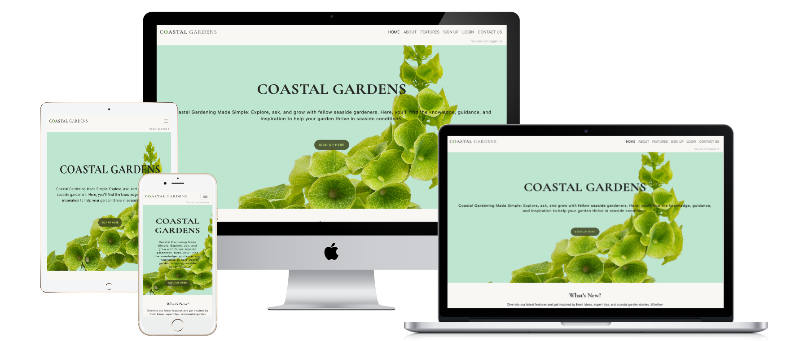

# COASTAL GARDENS



[View Live Website here.](https://coastal-gardens-e950c82335fb.herokuapp.com/)

[GitHub Repo](https://github.com/LemmenAid/coastal-gardens)

*** 

## Project Description  

_Coastal Gardens is a interactive website for my fourth portfolio project with [Code Institute](https://codeinstitute.net/ie/)._

Coastal Gardens is a web platform designed to connect and support coastal gardeners in Ireland and the UK. Focused on the unique challenges and rewards of gardening by the sea, the site provides accessible resources, insights, and a collaborative space for gardeners. Users can browse a curated selection of feature posts, explore their plant zone, and, by becoming members, unlock a personalized dashboard. Members have the opportunity to save favorite posts, keep track of their comments, and publish their own garden stories to inspire other coastal enthusiasts.

## Project Purpose

The purpose of Coastal Gardens is to foster a vibrant online community dedicated to coastal gardening. Recognizing the specific needs of the coastal region, the platform aims to be a comprehensive resource for both beginners and seasoned gardeners facing the unique conditions of seaside environments. By providing a space for knowledge exchange, storytelling, and advice, Coastal Gardens empowers gardeners to create thriving, resilient gardens and build connections with others who share similar experiences.

***

## Index – Table of Contents

* [User Experience (UX)](#user-experience)
* [Creating Process](#creating-process)
* [Design](#design)
* [Features](#features)
* [Libraries and Technologies Used](#libraries-and-technologies-used)
* [Testing](#testing)
* [Solved Bugs](#solved-bugs)
* [Deployment](#deployment)
* [Credits](#credits)

***

## User Experience (UX)

### User Stories

1. As a Visitor, I want to browse feature articles on coastal gardening, so that I can learn more about gardening by the sea.
2. As a Visitor, I want to understand the plant zone map, so I can determine in which zone I live.
3. As a Visitor, I want to read an About page to understand the purpose and mission of the site.
4. As a Visitor, I want to easily navigate to different sections of the site, so I can find relevant information quickly.

5. As a Potential Member, I want to view a sign-up page that explains the benefits of joining, so I know why I should become a member.
6. As a Potential Member, I want a simple registration process, so I can quickly join the community.

7. As a Member, I want a personalized dashboard where I can save and view my favorite articles, so I can easily revisit them.
8. As a Member, I want to see a list of all my comments in one place, so I can keep track of my participation.
9. As a Member, I want the ability to write and publish my own gardening stories, so I can share my experiences with other members.
10. As a Member, I want access to member-only stories, so I can learn from the experiences of other coastal gardeners.

11. As an Admin, I want to manage feature posts and member stories, so that the content is relevant, accurate, and engaging for users.
12. As an Admin, I want to moderate comments, so I can ensure a respectful and constructive environment.
13. As an Admin, I want to manage user accounts, so I can assist with membership issues and maintain site quality.

***

## Creating Process

When I started developing Coastal Gardens, it was my first time working on a project that combined both backend and frontend development, and my second time using Python. This project presented a steep learning curve, especially as I tackled the challenges of Django, CSS, and user interactivity. I wanted to create something with real-world application, so the idea of a resource for coastal gardeners felt both meaningful and practical.

At the beginning, I felt unsure about how to approach the project, but as I started coding, things began to click. Working through each part of the website—from creating personalized dashboards to designing the user experience—helped me better understand the concepts from my lessons. The process not only taught me more about Python logic and web frameworks, but also boosted my confidence as I realized I could solve problems and make the website functional.

The creative process became really enjoyable as I saw the website take shape, and I'm proud that it’s a tool gardeners in Ireland and the UK can use to share stories, access local gardening advice, and find inspiration for their coastal spaces.

### Project SetUp

For setting up Coastal Gardens, I followed the CodeStar follow-along project structure, customizing it to create a unique platform for coastal gardening enthusiasts.

I began by building a Django framework, developing the foundational pages (Home, About, Features, and Zone Map) that offer general information to anyone interested in coastal gardening. Once this structure was stable, I added unique member features, including personalized dashboards and the option for members to write and share blog posts exclusively within the community.

This was my first experience handling both backend and frontend tasks together, which was challenging but rewarding. Developing these elements involved custom logic for saving, displaying, and managing user-generated content in a way that’s engaging and intuitive. Testing each step along the way helped me ensure smooth functionality and an accessible user experience.

Overall, this process taught me a lot about web development and reinforced concepts from my coursework in a real-world setting, helping me build confidence in my coding abilities.

Jump to Credits: [Credits](#credits)

***

## Design

### Colour Scheme


The Coastal Gardens colour scheme draws inspiration from coastal landscapes, incorporating natural tones that aligns with the garden-focused theme.

* The palette centers on a calming green to echo the lushness of coastal plant life, balanced by subtle, neutral tones to maintain clarity and focus. 
* Light neutrals and deep charcoal are used for contrast, ensuring readability and accessible text elements without overwhelming the page.

This palette creates a welcoming environment that mirrors nature while being easy to navigate and visually pleasant.

### Typography

* The typography used throughout the site is PT Serif for headings, and Helvetica for paragraphs. 
 PT Serif is imported from google fonts. PT Serif was chosen for it’s readability in various sizes and to suit the botanical design of the website. As a fallback font Times and serif is used. The fallback font used for Helvetica is sans-serif. The letter spacing and line-height has been increased slightly to improve readability in the paragraphs. For the headings letter spacing has also been applied, as well as a heavier font weight to make them stand out more. 

The following code has been imported into the top of the style.css

    @import url('https://fonts.googleapis.com/css2?family=PT+Serif:ital,wght@0,400;0,700;1,400;1,700&display=swap');

<br>

### Call to Action

* The call to action buttons on the landing page lead to the three different quizes. At the end of each quiz there is a call to action button to replay the game and a button to play another game.
* All the buttons on the website are styled with a colour change so that it is clear for any visitor that these are buttons.
* The social media links will send the visitor to the social media pages. The links will open in a new tab.
* The header and footer logo have a colour change hover effect to make it clear that they are links.

### Imagery

Images used in the different quizes were selected for their aesthetic appeal and informative use.

Several free image sources were used. The links to these sources are listed here:

***

## Features 

### ASCII Art

ASCII Art is used as a title for the app to give the Surf Spot Finder a visual identity and to make it visually appealing.


### Slow Print

The majority of the text in the app is printed slowly to improve User experience and to make sure that the User is not overwhelmed by the text appearing on the screen.

### Welcome Message & Counties

* As soon as the page is loaded, the ASCII Art is displayed and a welcome message is gradually printed out. 
In the welcome message the purpuse of the app is explained. 

* After the welcome message a list of available Counties is displayed and the User is promted to choose a County where they want to go surfing.


### Surfspots

* After choosing a County the terminal is cleared and a list of available surfspots for that County is displayed. The User is asked if they want to explore one of these surfspots further or if they want to exit the program.


### Surfspot Details & Program Continue Options

* After choosing a spot more detailed information is given about the chosen spot.

* After the more detailed surfspot information is displayed, the User can choose between 3 options on how to continue in the app. They can either choose to explore another surfspot in the same County, choose a different County they want to explore or exit the program.


### Goodbye Message

* If the User chooses to leave the program a goodbye message is displayed. 


### Future Implementations

* In the future, the User name and favorite surf spots tracking functionality could be implemented.
* In the future I would like to add more information to the database, and cover all (coastal) Counties.
* Through further learning I would like to use a weather forcast API to add information to the surf spot details with current weather conditions.
* I would have loved to add a feature that User can store their favorite surf spots. After finishing the course I would like to come back to this project and create this feature. 

*** 

## Libraries and Technologies Used

* [Github](https://github.com/) - Used for hosting the repository.
* [Heroku](https://heroku.com/) - Used for deploying the live project.
* [Gitpod](https://www.gitpod.io/#get-started) - Used for developing the application.
* [Python](https://www.python.org/) - Used for adding functionality to the application.
* [Google Sheets](https://docs.google.com/spreadsheets/) - used for storing, editing and saving Surf Spot Finder database.
* [Google Cloud Platform](https://cloud.google.com/) - used to provide the APIs for connecting the data sheets with the Python code.
* [Lucidchart](https://lucid.co/) - Used for creating the app flowchart.
* [CI Python Linter](https://pep8ci.herokuapp.com/#) - Used for validation python code.

### Python Libraries

* [gspread](https://docs.gspread.org/en/v6.0.0/) - used to add, remove and manipulate data in the connected Google Sheets worksheets.
* [google.oauth.service_account](https://google-auth.readthedocs.io/en/master/reference/google.oauth2.service_account.html) - used for the authentication needed to access the Google APIs to connect the Service Account with the Credentials function. A CREDS.json file was generated with the details needed for the API to access the Google account which holds the Google Sheets worksheet containing the applications data. When deploying to Heroku, this information is then stored in the config var section to ensure the application will run.
* [Pyfiglet](https://pypi.org/project/pyfiglet/) - Used for the opening title and Goodbye message.
* [Time](https://docs.python.org/3/library/time.html) - Used for the slow print functionality and for delaying print statements.
* [Sys](https://docs.python.org/3/library/sys.html) - Used to provide access to some variables used or maintained by the interpreter.
* [Random](https://docs.python.org/3/library/random.html) - Used to add the slow_print functionality.
* [OS](https://docs.python.org/3/library/os.html) - Used to add the clear_terminal function for a neater flow of the program.

***

## Testing


### Python Validation

The [CI Python Linter](https://pep8ci.herokuapp.com/#) is used for validation python code. The run.py file was checked and a few errors were reported:


<br>
After fixing the errors, no errors were reported:

 


### Input Testing

During developments User input has been tested frequently to check if various inputs were valid, namely if the validation functions were catching all errors as expected. It was important that the User could easily navigate back to different Counties and surfspot options, as well as exiting the app. When testing User input I have repeatedly used the same set of input values: "Enter button only", "test" and "123".

All tests were completed in the local terminal as well as in the Heroku terminal.

| Feature                    | Tested?    | User Feedback Provided      |
|----------------------------|------------|-----------------------------|
| Choose County              | Yes        | Sorry, {user_county} is not a valid county. |
| Choose surfspot            | Yes        | {selected_spot} is not a valid surfspot. Please enter one of the available options.|
| Program continue options   | Yes        | {restart} is not a valid input! Please enter Y, N or C. |
| Exit                       | Yes        | Goodbye message is displayed. |


### Browser Testing  
Surf Spot Finder was tested through the Heroku app website on the following browsers without issues:  
- Google Chrome (Version 126.0.6478.182)
- Mozilla Firefox (Version 127.0.2)  
- Microsoft Edge (Version Version 126.0.2592.102) 

***

## Solved Bugs

* One bug that came up during testing was quite interesting and was only discovered by accident. The correct name for a County was entered, but accidentally had a blank space in front of it, the input was returned as not valid. After looking into this, I found that this could be solved by calling the .strip() function before calling the .capitalize() function on the User input:

 

***

## Deployment to Heroku

### Project Deployment

_I have used several different READMEs to write the deployment section of this README.<br> 
All listed in the credit section below._<br>

The application was deployed to Heroku. In order to deploy, the following steps were taken:

1. If you have an account, login to Heroku. Otherwise create a new account.
2. Once signed in, click the "New" button in the top right corner, below the header and choose "Create new app".
3. Choose a unique name for the application and select your region. When done, click "Create app".
4. This brings you to the "Deploy" tab. From here, click the "Settings" tab and scroll down to the "Config Vars" section and click on "Reveal Config Vars". 

- In the KEY input field, enter "PORT" and in the VALUE input field, enter "8000". After that, click the "Add" button on the right.

- In KEY enter "CREDS", in VALUE, paste in the text content of your CREDS.json file. 

5. In the Settings tab, in the Buildpack section, click the button "Add Buildpack".
6. First add "Python" package and then "node.js". 
7. If you exchanged the order of the packages: the Python buildpack must be above the NodeJS buildpack. You can drag the Python buildback to the top.
8. Scroll back to the top of the page and go to the "Deploy" tab. Choose "GitHub" as your Deployment method.
9. Go to "Connect to GiHub" section, search for the repository name and click "Connect".
10. In the "Automatic Deploys" section, choose your preferred method for deployment. I chose the 'automatic' option. Click "Deploy Branch".
11. Once the building of the app is finished you can click the "view" button to be redirected to the newly deployed site.

### Forking repo on GitHub

By forking the GitHub Repository we make a copy of the original repository on our GitHub account to view and/or make changes without affecting the original repository by using the following steps...

1. Log in to GitHub and locate the [GitHub Repository](https://github.com/)
2. At the top of the Repository (not top of page) just above the "Settings" Button on the menu, locate the "Fork" Button.
3. You should now have a copy of the original repository in your GitHub account.

### Making a Local Clone

1. Log in to GitHub and locate the [GitHub Repository](https://github.com/)
2. Under the repository name, click "Clone or download".
3. To clone the repository using HTTPS, under "Clone with HTTPS", copy the link.
4. Open Git Bash
5. Change the current working directory to the location where you want the cloned directory to be made.
6. Type `git clone`, and then paste the URL you copied in Step 3.

```
$ git clone https://github.com/YOUR-USERNAME/YOUR-REPOSITORY
```

7. Press Enter. Your local clone will be created.

```
$ git clone https://github.com/YOUR-USERNAME/YOUR-REPOSITORY
> Cloning into `CI-Clone`...
> remote: Counting objects: 10, done.
> remote: Compressing objects: 100% (8/8), done.
> remove: Total 10 (delta 1), reused 10 (delta 1)
> Unpacking objects: 100% (10/10), done.
```

***

## Credits

* I would like to thank Brian Macharia for his great mentor support and guidance - helping me through the process of building my first ever CLI application.
* My facilitator Amy from Code Institute for supporting us through our third project and giving us great tips and resources for learning tools, and her feedback during the weekly stand-ups.
* At last I would like to give thanks to my friends and family for taking the time to test the application and giving me great feedback.

### Content

I have taken information from the following websites for the Surf Spot Google Sheet:
* [Surf Forecast](https://www.surf-forecast.com/)
* [Discovering Cork](http://www.discoveringcork.ie/surfing/)
* [Surfer Today](https://www.surfertoday.com/surfing/the-best-surf-spots-in-ireland)
* [Surfline](https://www.surfline.com/travel/ireland-surfing-and-beaches/2963597)


### Code

The walkthrough project "Love Sandwiches" was a great way of understanding how to get started on an CLI application and it was therefor a good source of inspiration. 
I decided to make an app that can help users to find information on surfspots per County in Ireland. 
I have used various resources to help me with figuring out how to create the Surf Spot Finder app:

* [Stack overflow](https://stackoverflow.com/)
* [Pep Style Guide](https://peps.python.org/pep-0008/)
* [W3Schools](https://www.w3schools.com/)
* [The Hitchhiker's Guide to Python](https://docs.python-guide.org/writing/style/)
* [Real Python - for quick tutorials on several subjects](https://realpython.com/)
* [Real Python - Name-Main](https://realpython.com/if-name-main-python/)
* [Real Python - While loops](https://realpython.com/python-while-loop/)
* [Pypi - ASCII title banner](https://pypi.org/project/pyfiglet/)
* [Stack Overflow - Slow Printing](https://stackoverflow.com/questions/15375368/slow-word-by-word-terminal-printing-in-python)
* [Stack Overflow - clear terminal](https://stackoverflow.com/questions/2084508/clear-the-terminal-in-python)
* [W3Schools - strip()](https://www.w3schools.com/python/ref_string_strip.asp)
* [Tripleten - best practices](https://tripleten.com/blog/posts/python-best-practices)

* Code Institute Slack Channel


### Templates I have used for inspiration and creating my readme-file:

I have used several readme file as inspiration to write this readme:

* [Sample README Code Institute](https://github.com/Code-Institute-Solutions/SampleREADME/blob/master/README.md?plain=1) - Copied the Deployment section and used for general guideline.
* [Towers of Hanoi - Lucia2007](https://github.com/lucia2007/towers-of-hanoi/) - For general inspiration and the Heroku Deployment section for this readme.
* [Weather Checker - mdurmus](https://github.com/mdurmus/weather-checker/) - Used for general guideline.
* [Read Me Template Code Institute](https://github.com/Code-Institute-Solutions/readme-template/blob/master/README.md)
Used for general guideline.
* [Plant Factory - crypticCaroline](https://github.com/crypticCaroline/ms1-plantfactory/blob/master/README.md?plain=1) - Especially for the Technologies Used, Testing sections and design sections.
* [Visit Järbo - ClaudiaInSweden](https://github.com/ClaudiaInSweden/visit-jarbo/blob/main/README.md?plain=1) - General inspiration / guideline.
* [GitHub Docs](https://docs.github.com/en)